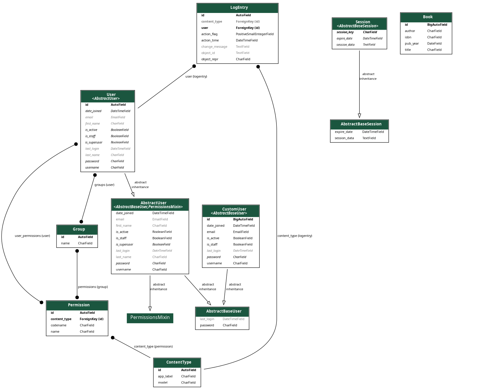

# Настройка проекта "Testapp"

<h3>Установка проекта</h3>

1. Клонирование репозитория:

        git clone <https://github.com/atabekdemurtaza/testapp.git>

2. Перейдите в директорию проекта:

        cd testapp

3. Создайте и активируйте виртуальное окружение:

        python -m venv venv
        source venv/bin/activate

4. Установите зависимости:

        pip install -r requirements/base.txt

<h3>Настройка .env файла</h3>

        # Настройки Django
        DEBUG=True
        SECRET_KEY=(t@r6s=y8b(tr!z8i+tx90nze9x_c$d9uqzcea8py4sq$f40rq
        DJANGO_ALLOWED_HOSTS=localhost

        # Настройки БД (замените на свои значения)
        DB_NAME=testapp
        DB_USER=admin
        DB_PASSWORD=password
        DB_HOST=db
        DB_PORT=5432

<h3>Запуск проекта с Docker</h3>

1.Убедитесь, что у вас установлен Docker и Docker Compose.
2.Создайте и примените миграции Django:

        docker-compose run web python manage.py migrate

3.Запустите проект:

        docker-compose up

Приложение будет доступно по адресу http://localhost:8000/.

<h3>Работа с API</h3>
<h4>Документация API:</h4>

Получение списка пользователей:

        GET /api/users/

Получение информации о пользователе:

        GET /api/users/{user_id}/

Создание нового пользователя:

        POST /api/register/

Параметры:

        {
            "email": "user@example.com",
            "username": "username",
            "password": "securepassword"
        }

Обновление информации о пользователе:

        PUT /api/users/{user_id}/

Параметры:

        {
            "email": "new_email@example.com",
            "username": "new_username"
        }

Удаление пользователя:

        DELETE /api/users/{user_id}/

<h3>Завершение работы</h3>
<h4>Остановите контейнеры:</h4>

    docker-compose down

Деактивируйте виртуальное окружение:

    deactivate

<h3>Структура БД</h3>

<b>Пользователи</b>

<b>Книги</b>

